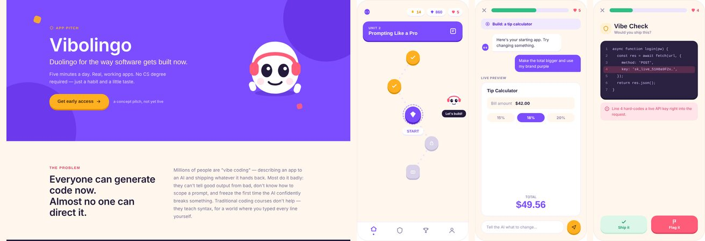

# Vibolingo

**Duolingo for the way software gets built now.**
Five minutes a day. Real, working apps. No CS degree required.

**[Live demo](https://meuselina.github.io/Vibolingo/)** · concept prototype, not a live product.



## The problem

Everyone can generate code now. Almost no one can direct it.
Millions of people are "vibe coding": describing an app to an AI and shipping whatever it hands back, without knowing whether it is safe or any good.

## The idea

Vibolingo teaches people to *direct* AI the way Duolingo teaches a language: short daily lessons, streaks, XP and leagues.

## Screens

| Screen | What it shows |
|---|---|
| `Main.dc.html` | App pitch |
| `Home.dc.html` | Learning path with units like "Prompting Like a Pro" |
| `Lesson.dc.html` | A lesson: change a live tip calculator app by telling the AI what to do |
| `VibeCheck.dc.html` | "Would you ship this?" Spot problems in AI generated code, e.g. a hard coded API key |
| `Streak.dc.html` | Streak and weekly league |
| `Profile.dc.html` | Profile with shipped apps |
| `Icon.dc.html` | App icon |
| `Demo.dc.html` | Clickable demo |
| `index.html` | Start page linking all screens |

## Run locally

The screens load their components at runtime, so they need a small web server (opening the files directly does not work):

```bash
python3 -m http.server 8000
```

Then open http://localhost:8000 for the overview of all screens.

## Built with

HTML, CSS, JavaScript
